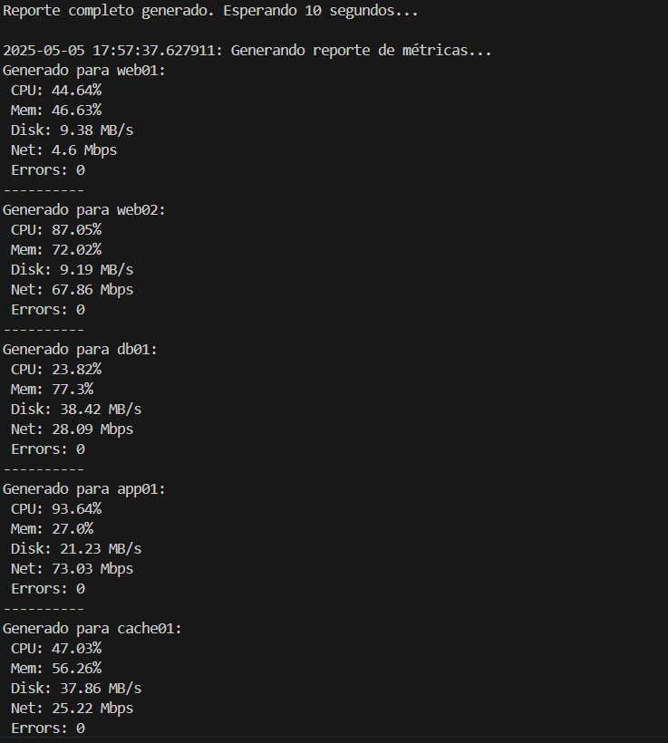
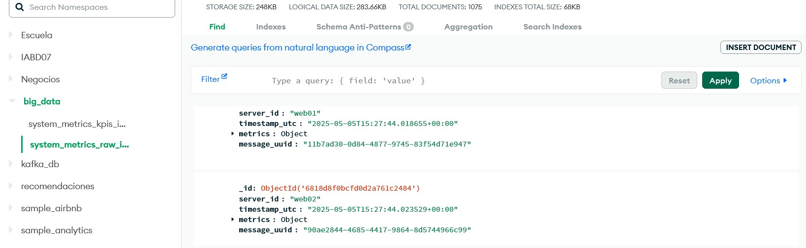
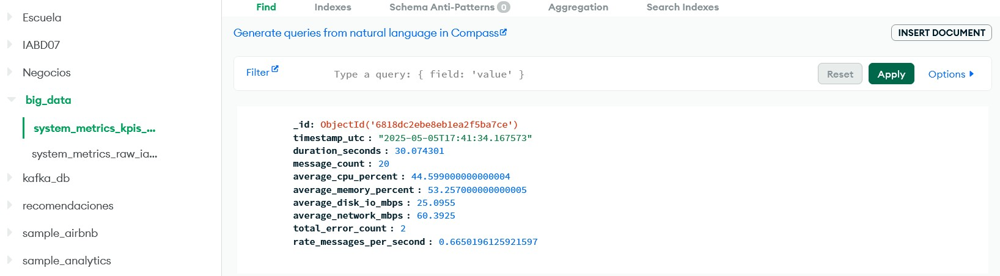

# Monitoreo_Sistema_Kafka_MongoDB

Este proyecto simula la monitorización de una infraestructura utilizando Apache Kafka y MongoDB Atlas. El objetivo es simular un conjunto de servidores que generan métricas de rendimiento (CPU, memoria, disco, red, errores) y enviarlas a través de Kafka. Un consumidor procesa estas métricas, las almacena en MongoDB y calcula KPIs agregados que permiten obtener una visión general del estado del sistema.

## Descripción del Proyecto

En este proyecto hemos implementado dos componentes principales:

1. **Productor (Producer)**: Simula la generación de métricas de rendimiento para varios servidores, las envía a través de Apache Kafka.
2. **Consumidor (Consumer)**: Recibe las métricas desde Kafka, las almacena en MongoDB y calcula KPIs agregados como el promedio de uso de CPU, memoria, y rendimiento de red/disco.

## Herramientas Utilizadas

- **Apache Kafka**: Utilizado para la transmisión de datos entre el productor y el consumidor.
- **MongoDB Atlas**: Usado para almacenar tanto las métricas brutas como los KPIs calculados.
- **Python**: Lenguaje de programación utilizado para implementar tanto el productor como el consumidor.
  - Librerías utilizadas:
    - `kafka-python`: Para la conexión con Kafka.
    - `pymongo`: Para interactuar con MongoDB Atlas.
    - `random`, `time`, `uuid`, `json`, `datetime`: Utilizadas para simular las métricas y procesarlas.

## Instalación

Para ejecutar este proyecto, necesitas instalar las dependencias de Python necesarias y tener acceso a un clúster de MongoDB Atlas.
A su vez hay que tener una instancia de Kafka corriendo en tu máquina. Puedes usar Docker para levantar Kafka si no lo tienes instalado localmente: 
- docker-compose up -d

## Ejecución del Productor

El Productor simula la generación de métricas y las envía a Kafka. Para ejecutar el productor, solo necesitas ejecutar el siguiente script:

- python productor_metrics_iabd07.py

Este script generará métricas de rendimiento para cada servidor en intervalos de tiempo predefinidos (por ejemplo, cada 10 segundos) y las enviará al topic de Kafka.

## Ejecución del Consumidor

El Consumidor se suscribe al topic de Kafka y procesa las métricas enviadas por el productor y las almacena las métricas en MongoDB Atlas (colección_system_metrics_raw_iabd07). Tambien calcula los KPIs cada 20 mensajes y almacena los resultados en otra colección separada en MongoDB Atlas (colección_system_metrics_kpis_iabd07)

Para ejecutar el consumidor, ejecuta el siguiente script:

- python consumidor_metrics_iabd07.py

## Capturas de Pantalla

Productor Enviando Datos

En esta imagen se muestra el productor generando y enviando métricas a Kafka.

Consumidor Recibiendo Datos

Esta imagen muestra el proceso de consumo de datos desde Kafka y su almacenamiento en MongoDB.

Colección de Métricas Brutas en MongoDB

Aquí se muestra cómo se almacenan las métricas brutas de los servidores en la colección system_metrics_raw_iabd07.

Colección de KPIs en MongoDB

Aquí se muestra cómo se almacenan los KPIs calculados en la colección system_metrics_kpis_iabd07 en MongoDB Atlas.

